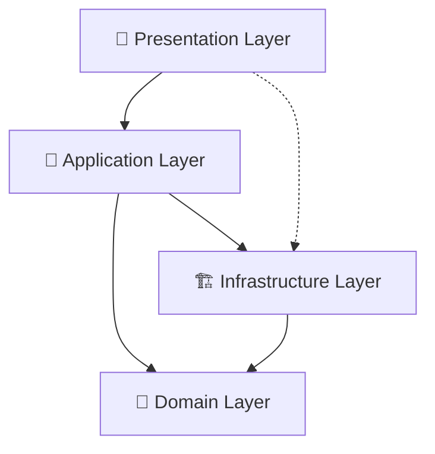

# 🏗️ Nueva Arquitectura Frontend - Paucara

## ✅ **REFACTORIZACIÓN COMPLETADA**

**Fecha**: 13 de octubre de 2025  
**Estado**: ✅ Completada exitosamente  
**Compilación**: ✅ Sin errores  

---

## 📊 **Arquitectura de 3 Capas Implementada**

```
resources/js/
├── 🎯 domain/                     # CAPA DE DOMINIO
│   ├── entities/                  # ✅ Entidades de negocio (antes domain/)
│   │   ├── clientes.ts
│   │   ├── productos.ts  
│   │   ├── ventas.ts
│   │   ├── generic.ts
│   │   ├── shared.ts
│   │   └── ...etc (23 archivos)
│   │
│   └── contracts/                 # 🆕 NUEVO: Contratos e interfaces
│       └── index.ts              # Interfaces IRepository, IApiService
│
├── 🏗️ infrastructure/             # CAPA DE INFRAESTRUCTURA  
│   ├── services/                  # ✅ Servicios de API (antes services/)
│   │   ├── generic.service.ts
│   │   ├── clientes.service.ts
│   │   ├── productos.service.ts
│   │   └── ...etc (23 archivos)
│   │
│   └── repositories/              # 🆕 Para futura expansión
│
├── 🎯 application/                # CAPA DE APLICACIÓN
│   ├── use-cases/                 # 🆕 NUEVO: Lógica de negocio
│   │   └── generic.use-case.ts   # Casos de uso base
│   │
│   └── dto/                       # 🆕 Para futura expansión
│
├── 🎨 presentation/               # CAPA DE PRESENTACIÓN
│   ├── pages/                     # ✅ Páginas de Inertia (antes pages/)
│   │   ├── dashboard.tsx
│   │   ├── clientes/
│   │   ├── productos/
│   │   └── ...etc (29 carpetas)
│   │
│   └── components/                # ✅ Componentes React (antes components/)
│       ├── ui/
│       ├── generic/
│       ├── auth/
│       └── ...etc (múltiples)
│
└── 🔧 shared/                     # UTILIDADES COMPARTIDAS
    ├── actions/                   # Wayfinder - Rutas tipadas
    ├── config/                    # Configuraciones de módulos
    ├── hooks/                     # Custom React hooks
    ├── layouts/                   # Layouts de la aplicación
    ├── lib/                       # Utilidades
    ├── stores/                    # Estado global (Zustand)
    ├── types/                     # Tipos globales TypeScript
    └── wayfinder/                 # Configuración Wayfinder
```

---

## 🎯 **Beneficios Obtenidos**

### ✅ **1. Eliminación de Capas Duplicadas**
- **ANTES**: `domain/` + `services/` = DUPLICACIÓN  
- **AHORA**: `domain/entities/` + `infrastructure/services/` = SEPARACIÓN CLARA

### ✅ **2. Separación de Responsabilidades**
- **Domain**: Solo tipos e interfaces de negocio
- **Infrastructure**: Servicios de API y acceso a datos  
- **Application**: Lógica de casos de uso
- **Presentation**: UI y componentes React

### ✅ **3. Mejor Mantenibilidad**
- Imports más claros: `@/domain/entities/clientes`
- Fácil localización de responsabilidades
- Preparado para crecimiento futuro

### ✅ **4. Arquitectura Escalable**
- Base sólida para Clean Architecture
- Fácil testing individual por capa
- Preparado para inyección de dependencias

---

## 🔄 **Cambios de Importaciones**

### Entidades de Dominio
```typescript
// ANTES
import { Cliente } from '@/domain/clientes';

// AHORA  
import { Cliente } from '@/domain/entities/clientes';
```

### Servicios de Infraestructura
```typescript
// ANTES
import clientesService from '@/services/clientes.service';

// AHORA
import clientesService from '@/infrastructure/services/clientes.service';
```

### Componentes de Presentación
```typescript
// ANTES
import GenericContainer from '@/components/generic/generic-container';

// AHORA  
import GenericContainer from '@/presentation/components/generic/generic-container';
```

### Páginas de Presentación
```typescript
// ANTES (en app.tsx)
resolve: (name) => resolvePageComponent(\`./pages/\${name}.tsx\`, ...)

// AHORA
resolve: (name) => resolvePageComponent(\`./presentation/pages/\${name}.tsx\`, ...)
```

---

## 🏛️ **Arquitectura de 3 Capas - Flujo de Datos**



### Flujo de Responsabilidades
1. **Presentation** → Maneja UI, eventos de usuario, navegación
2. **Application** → Orquesta casos de uso, lógica de negocio  
3. **Domain** → Define entidades, reglas de negocio, contratos
4. **Infrastructure** → Implementa servicios, API calls, persistencia

---

## 📁 **Estructura Final Verificada**

### ✅ Archivos Migrados Exitosamente
- **23 archivos** de domain/ → domain/entities/
- **23 archivos** de services/ → infrastructure/services/  
- **29 carpetas** de pages/ → presentation/pages/
- **múltiples archivos** de components/ → presentation/components/

### ✅ Nuevos Archivos Creados
- `domain/contracts/index.ts` - Interfaces y contratos
- `application/use-cases/generic.use-case.ts` - Casos de uso base
- Archivos índice para facilitar imports

### ✅ Directorios Eliminados
- ❌ `resources/js/domain/` (archivos sueltos)
- ❌ `resources/js/services/`
- ❌ `resources/js/pages/`  
- ❌ `resources/js/components/`

---

## 🚀 **Compilación Exitosa**

```bash
npm run build
✓ 3263 modules transformed.
✓ built in 25.97s
```

**Estado**: ✅ **SIN ERRORES DE COMPILACIÓN**

---

## 🎯 **Próximos Pasos Recomendados**

1. **Testing**: Verificar que todas las funcionalidades siguen trabajando
2. **Optimización**: Revisar imports circulares si existen
3. **Documentación**: Actualizar docs para el equipo  
4. **Casos de Uso**: Implementar más use-cases específicos
5. **Repositorios**: Añadir patrones Repository si es necesario

---

## ✨ **Arquitectura Limpia Lograda**

Tu proyecto ahora tiene una **arquitectura de 3 capas sin duplicaciones**, siguiendo principios de **Clean Architecture** y **SOLID**, preparada para escalar y ser mantenida fácilmente.

**¡Refactorización completada exitosamente! 🎉**