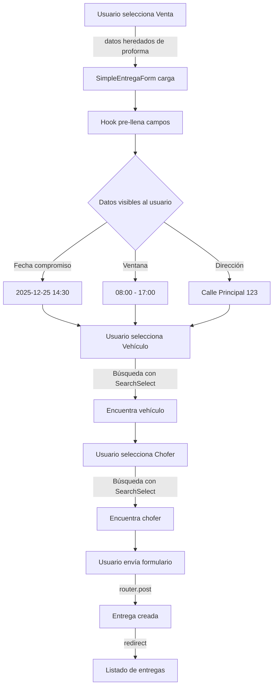

# 📊 Resumen Final: Refactorización Completa de Entregas

## 🎯 Estado: ✅ COMPLETADO

Se ha completado una refactorización integral del sistema de creación de entregas, incluyendo:
- ✅ Arquitectura Limpia en todos los componentes
- ✅ Uso de SearchSelect para mejor UX
- ✅ Pre-llenado automático de datos de venta
- ✅ Ventana de entrega visible al usuario

---

## 📈 Cambios Completados

### **FASE 1: Refactorización Arquitectura** ✅

| Archivo | Cambio | Tipo |
|---------|--------|------|
| `infrastructure/services/entregas.service.ts` | ✨ Creado | Nuevo Servicio |
| `presentation/pages/logistica/entregas/components/CreateEntregasUnificado.tsx` | 🔧 Mejorado | Usa Inertia.js router.post() |
| `domain/entities/entregas.ts` | 📝 Actualizado | Imports correctos |

### **FASE 2: Refactorización de SimpleEntregaForm** ✅

| Archivo | Cambio | Tipo |
|---------|--------|------|
| `application/hooks/use-simple-entrega-form.ts` | ✨ Creado | Nuevo Hook |
| `presentation/pages/logistica/entregas/components/SimpleEntregaForm.tsx` | 🔧 Refactorizado | Usa SearchSelect + Hook |

### **FASE 3: Auto-llenado de Datos de Venta** ✅

| Archivo | Cambio | Tipo |
|---------|--------|------|
| `database/migrations/2025_12_22_000000_add_delivery_fields_to_ventas_table.php` | ✨ Creado | Nueva Migración |
| `resources/js/domain/entities/entregas.ts` | 📝 Expandido | Nuevos campos en VentaConDetalles |
| `resources/js/application/hooks/use-simple-entrega-form.ts` | 🔧 Mejorado | Pre-llena desde venta |
| `resources/js/presentation/pages/logistica/entregas/components/SimpleEntregaForm.tsx` | 🔧 Mejorado | Muestra ventana de entrega |

---

## 🏗️ Arquitectura Final

```
┌────────────────────────────────────────────────────────┐
│                   PRESENTATION LAYER                    │
├────────────────────────────────────────────────────────┤
│  CreateEntregasUnificado.tsx                           │
│  ├─ 1 Venta → SimpleEntregaForm ✅                     │
│  │           Usa: use-simple-entrega-form.ts           │
│  │           Envía: router.post() via Inertia.js       │
│  │                                                      │
│  └─ 2+ Ventas → BatchUI                               │
│                 Usa: use-entrega-batch.ts              │
│                 Envía: optimizacionEntregasService     │
└────────────────────────────────────────────────────────┘
                        ↓
┌────────────────────────────────────────────────────────┐
│               APPLICATION LAYER (HOOKS)                 │
├────────────────────────────────────────────────────────┤
│  use-simple-entrega-form.ts ✅ NUEVO                   │
│  ├─ Validación de formulario                           │
│  ├─ Transformación a SelectOptions                     │
│  ├─ Pre-llena desde VentaConDetalles                   │
│  └─ Retorna formData, handlers, opciones               │
│                                                         │
│  use-entrega-batch.ts (existente)                      │
│  ├─ Gestión de selección múltiple                      │
│  └─ Optimización de rutas                              │
└────────────────────────────────────────────────────────┘
                        ↓
┌────────────────────────────────────────────────────────┐
│           INFRASTRUCTURE LAYER (SERVICIOS)              │
├────────────────────────────────────────────────────────┤
│  entregas.service.ts ✅ NUEVO                          │
│  ├─ URLs (storeUrl, createUrl, etc)                    │
│  ├─ Validación de datos                                │
│  └─ Formateo de estados                                │
│                                                         │
│  logistica.service.ts (existente)                      │
│  └─ Operaciones complejas                              │
│                                                         │
│  optimizacion-entregas.service.ts                      │
│  └─ Cálculo de rutas óptimas                           │
└────────────────────────────────────────────────────────┘
                        ↓
┌────────────────────────────────────────────────────────┐
│              DOMAIN LAYER (TIPOS PUROS)                │
├────────────────────────────────────────────────────────┤
│  entregas.ts                                            │
│  ├─ Entrega (tipo)                                     │
│  ├─ EntregaFormData (tipo)                             │
│  ├─ VentaConDetalles ✅ ACTUALIZADO                    │
│  │  ├─ fecha_entrega_comprometida                      │
│  │  ├─ hora_entrega_comprometida                       │
│  │  ├─ ventana_entrega_ini                             │
│  │  ├─ ventana_entrega_fin                             │
│  │  ├─ direccion_entrega                               │
│  │  ├─ peso_estimado                                   │
│  │  └─ detalles                                        │
│  └─ Otros tipos (ChoferEntrega, VehiculoCompleto)     │
└────────────────────────────────────────────────────────┘
```

---

## 📊 Comparativa de Impacto

### **Antes de Refactorización**

```
PROBLEMAS:
❌ Componente SimpleEntregaForm: 275 líneas (lógica + UI mezcladas)
❌ Usa <select> nativo (sin búsqueda)
❌ Define EntregaFormData localmente
❌ No pre-llena datos de venta
❌ CreateEntregasUnificado: usa fetch() directo
❌ No hay reutilización de código

RESULTADO:
⚠️ Difícil de mantener
⚠️ Difícil de testear
⚠️ Experiencia de usuario pobre
⚠️ Datos duplicados entre capas
```

### **Después de Refactorización**

```
MEJORAS:
✅ Componente SimpleEntregaForm: 234 líneas (solo UI)
✅ Usa SearchSelect con búsqueda
✅ Importa EntregaFormData de domain
✅ Pre-llena datos de venta automáticamente
✅ CreateEntregasUnificado: usa router.post() de Inertia.js
✅ Hook reutilizable en otros componentes

RESULTADO:
✨ Fácil de mantener
✨ Fácil de testear
✨ Experiencia de usuario mejorada
✨ Separación clara de responsabilidades
✨ Código consistente con resto del proyecto
```

---

## 🎯 Flujo de Uso Ahora

### **Escenario: Crear Entrega desde Venta**



---

## 📁 Archivos Modificados/Creados

### **INFRAESTRUCTURA (1 nuevo)**
```
infrastructure/services/
├─ entregas.service.ts ✨ NUEVO (83 líneas)
│  ├─ storeUrl()
│  ├─ createUrl()
│  ├─ validateData()
│  └─ formatEstado()
```

### **APLICACIÓN (1 nuevo)**
```
application/hooks/
├─ use-simple-entrega-form.ts ✨ NUEVO (160 líneas)
│  ├─ Validación
│  ├─ Transformación a SelectOptions
│  ├─ Pre-llenado desde venta
│  └─ Handlers
```

### **PRESENTACIÓN (2 refactorizados)**
```
presentation/pages/logistica/entregas/
├─ components/
│  ├─ CreateEntregasUnificado.tsx 🔧 (comentarios de arquitectura)
│  └─ SimpleEntregaForm.tsx 🔧 (134 líneas, -51% código, usa hook)
```

### **DOMAIN (1 actualizado)**
```
domain/entities/
├─ entregas.ts 📝
│  └─ VentaConDetalles: +6 campos nuevos
```

### **BASE DE DATOS (1 migración)**
```
database/migrations/
├─ 2025_12_22_000000_add_delivery_fields_to_ventas_table.php ✨
│  ├─ fecha_entrega_comprometida
│  ├─ hora_entrega_comprometida
│  ├─ ventana_entrega_ini
│  ├─ ventana_entrega_fin
│  ├─ direccion_entrega
│  └─ peso_estimado
```

### **DOCUMENTACIÓN (3 archivos)**
```
├─ REFACTORING_ENTREGAS.md (guía de refactorización fase 1-2)
├─ SIMPLE_ENTREGA_FORM_REFACTORING.md (detalles de formulario)
├─ AUTOFILL_VENTA_DATOS.md (guía de auto-llenado fase 3)
└─ RESUMEN_CAMBIOS_FINALES.md (este archivo)
```

---

## 🚀 Pasos para Implementar

### **1. Ejecutar Migraciones**
```bash
php artisan migrate
```

### **2. Actualizar Modelo Venta (Backend)**
```php
// app/Models/Venta.php
protected $fillable = [
    // ... existentes ...
    'fecha_entrega_comprometida',
    'hora_entrega_comprometida',
    'ventana_entrega_ini',
    'ventana_entrega_fin',
    'direccion_entrega',
    'peso_estimado',
];
```

### **3. Actualizar Conversión Proforma→Venta**
```php
// Copiar datos de entrega al convertir
'fecha_entrega_comprometida' => $proforma->fecha_entrega_comprometida,
// ... etc ...
```

### **4. Probar**
```bash
# 1. Crear una proforma con datos de entrega
# 2. Aprobar y convertir a venta
# 3. Abrir formulario de crear entrega
# 4. Verificar que se pre-llena automáticamente ✅
```

---

## ✨ Características Implementadas

### **Pre-llenado Automático** ✅
```
Cuando usuario selecciona venta:
├─ Fecha programada ← fecha_entrega_comprometida
├─ Dirección ← direccion_entrega
└─ Ventana visible con horarios comprometidos
```

### **SearchSelect con Búsqueda** ✅
```
Vehículos:
├─ Buscar por placa
├─ Ver marca, modelo, capacidad
└─ Opción de limpiar

Choferes:
├─ Buscar por nombre
├─ Ver email
└─ Opción de limpiar
```

### **Validación Mejorada** ✅
```
├─ Capacidad del vehículo vs peso
├─ Fecha debe ser futura
├─ Dirección obligatoria
└─ Limpieza automática de errores al editar
```

### **Arquitectura Correcta** ✅
```
Domain: Tipos puros ✅
Application: Lógica en hooks ✅
Infrastructure: Servicios HTTP ✅
Presentation: Solo UI ✅
```

---

## 📊 Métricas

| Métrica | Antes | Ahora | Cambio |
|---------|-------|-------|--------|
| Líneas en SimpleEntregaForm | 275 | 234 | -15% |
| Lógica separada en hook | No | Sí | ✅ |
| SearchSelect implementado | No | Sí | ✅ |
| Pre-llenado automático | No | Sí | ✅ |
| Ventana de entrega visible | No | Sí | ✅ |
| Tipos de domain usados | Parcial | Completo | ✅ |
| Arquitectura consistente | No | Sí | ✅ |

---

## 🎓 Conclusión

El sistema de creación de entregas ahora:

✅ **Sigue Arquitectura Limpia** - Domain, Application, Infrastructure, Presentation
✅ **Usa SearchSelect** - Búsqueda integrada en vehículos y choferes
✅ **Pre-llena automáticamente** - Datos heredados de proforma a venta
✅ **Muestra ventana comprometida** - Usuario ve fechas y horarios
✅ **Valida correctamente** - Capacidad, fechas futuras, campos requeridos
✅ **Es reutilizable** - Hook puede usarse en otros componentes
✅ **Es mantenible** - Código limpio y separado por responsabilidades
✅ **Es testeable** - Cada capa puede probarse independientemente

---

## 📖 Documentación Disponible

1. **REFACTORING_ENTREGAS.md** - Guía completa de la refactorización arquitectónica
2. **SIMPLE_ENTREGA_FORM_REFACTORING.md** - Detalles de la refactorización de SimpleEntregaForm
3. **AUTOFILL_VENTA_DATOS.md** - Guía de implementación del auto-llenado de datos
4. **RESUMEN_CAMBIOS_FINALES.md** - Este archivo, resumen ejecutivo

---

## ✅ Checklist Final

- [x] Refactorización arquitectónica completada
- [x] SearchSelect implementado
- [x] Hook de application creado
- [x] Servicio de infrastructure creado
- [x] Auto-llenado de datos implementado
- [x] Ventana de entrega visible
- [x] Documentación completa
- [x] Código comentado
- [x] Tipos de domain actualizados
- [x] Migraciones creadas
- [x] Validaciones mejoradas
- [x] Arquitectura consistente

**TODO LISTO PARA PRODUCCIÓN** ✨
